# PeriDEM - High-fidelity modeling of granular media consisting of deformable complex-shaped particles

[](https://app.codacy.com/gh/prashjha/PeriDEM?utm_source=github.com&utm_medium=referral&utm_content=prashjha/PeriDEM&utm_campaign=Badge_Grade_Settings) [](https://circleci.com/gh/prashjha/PeriDEM) [](https://codecov.io/gh/prashjha/PeriDEM) [](https://GitHub.com/prashjha/PeriDEM/releases/) [](https://github.com/prashjha/PeriDEM/blob/main/LICENSE) [](https://github.com/prashjha/PeriDEM/issues) [](https://gitter.im/PeriDEM/community?utm_source=badge&utm_medium=badge&utm_campaign=pr-badge&utm_content=badge) [](https://GitHub.com/prashjha/PeriDEM/) [](https://zenodo.org/records/13888588) [](https://doi.org/10.21105/joss.07525)


<p align="center"> 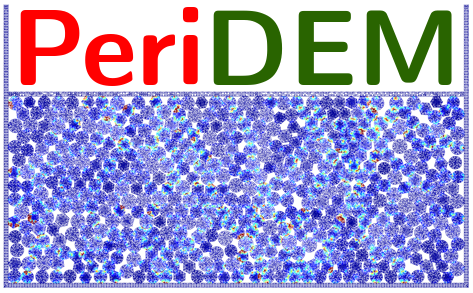 </p>

## Table of contents

  - [Introduction](#Introduction)
  - [Documentation](#Documentation)
  - [Tutorial](#Tutorial)
  - [Examples](#Examples)
  - [Brief implementation details](#Brief-implementation-details)
  - [Installation](#Installation)
    * [Dependencies](#Dependencies)
    * [Building the code](#Building-the-code)
    * [Recommendations for quick build](#Recommendations-for-quick-build)
    * [Install & use as a CMake package](#install--use-as-a-cmake-package)
    * [Parallelism (MPI)](#parallelism-mpi)
  - [Running simulations](#Running-simulations)
    * [Deck layout (JSON)](#Deck-layout-JSON)
    * [Two-particle contact](#Two-particle-contact)
    * [Compressive test](#Compressive-test)
    * [Attrition](#Attrition)
    * [Impact and fracture](#Impact-and-fracture)
    * [Single-particle Peridynamics](#Single-particle-Peridynamics)
  - [Visualizing results](#Visualizing-results)
  - [Contributing](#Contributing)
  - [Citations](#Citations)
  - [Developers](#Developers)

## Introduction

Implementation of the high-fidelity model of granular media that combines the advantages 
of peridynamics and the discrete element method (DEM). 
The model has the following advantages over existing mechanical models for granular media:
  - handle intra-particle deformation and breakage/damage
  - handle the arbitrary shape of the particle. Inter-particle contact is not specific to any shape of the particle
  - tunable inter-particle contact parameters
  - easy to add different mechanical constitutive laws within peridynamics for individual particle deformation

For more details about the model and results, we refer to the paper:

> Prashant K. Jha, Prathamesh S. Desai, Debdeep Bhattacharya, Robert P Lipton (2020). 
> **Peridynamics-based discrete element method (PeriDEM) model of granular systems involving breakage of arbitrarily shaped particles**. 
> *Journal of the Mechanics and Physics of Solids*, 151, p.104376. Doi https://doi.org/10.1016/j.jmps.2021.104376.
> Download pdf [here](https://prashjha.github.io/publication/jha-2020-peridem/jha-2020-peridem.pdf).

**PeriDEM is published as a software article in the Journal of Open Source Software:**
> Prashant K. Jha (2025).
> **PeriDEM -- High-fidelity modeling of granular media consisting of deformable complex-shaped particles**
> *Journal of Open Source Software*, vol. 10, 116, p.7525, DOI 10.21105/joss.07525.
> Download pdf [here](https://doi.org/10.21105/joss.07525).

We have created channels on various platforms: 
- [PeriDEM on Gitter](https://gitter.im/PeriDEM/community?utm_source=share-link&utm_medium=link&utm_campaign=share-link)
  * Gitter is absolutely open and easy to join.
- [PeriDEM on slack](peridem.slack.com)
  * Email us if interested in joining the workspace.

## Documentation

[Doxygen generated documentation](https://prashjha.github.io/PeriDEM/) details functions and objects in the library. 

## Tutorial

Problem setup for current `bin/PeriDEM` is under [examples/](./examples/README.md)
(see [Running simulations](#Running-simulations)). JSON decks only.

## Examples

We next highlight some key examples. Further details are available in [examples/README.md](./examples/README.md). 

### Two-particle tests

|      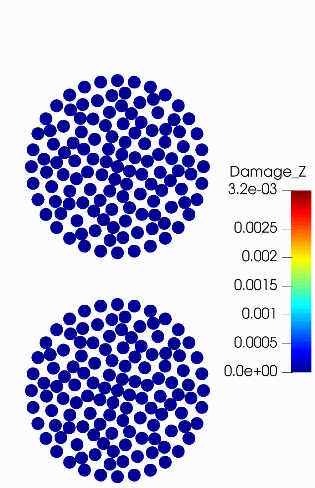       |           |
|:-------------------------------------------------------------------------:|:--------------------------------------------------------------------:|
| Circular without damping | Circular with damping |

|    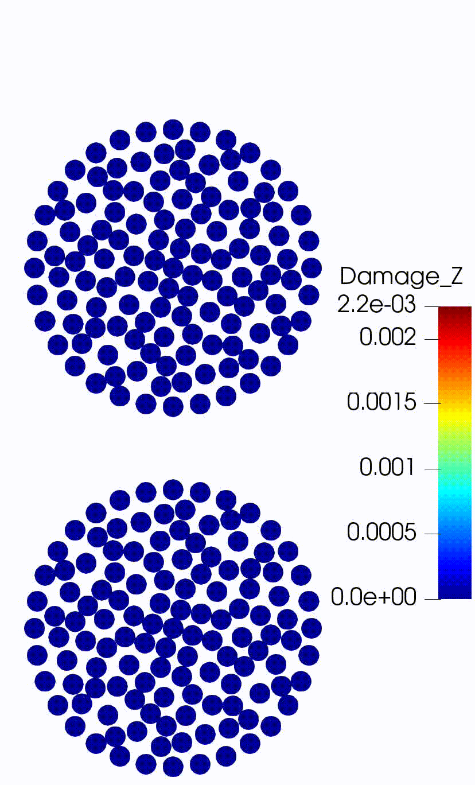    |   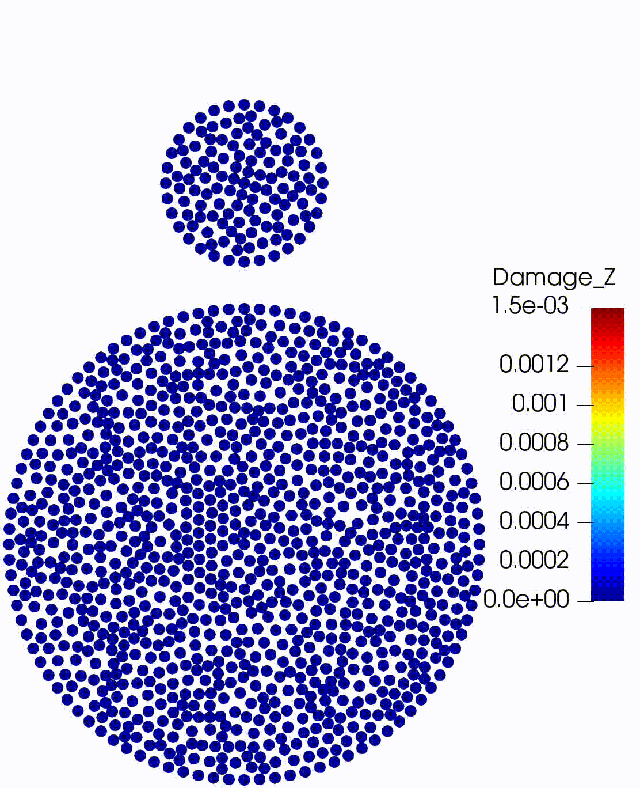   |                        |
|:--------------------------------------------------------------------------:|:---------------------------------------------------------------------------:|:------------------------------------------------------------------------------------------------------:|
| Different materials | Different radius | Different radius different material |

### Two-particle with wall test

|   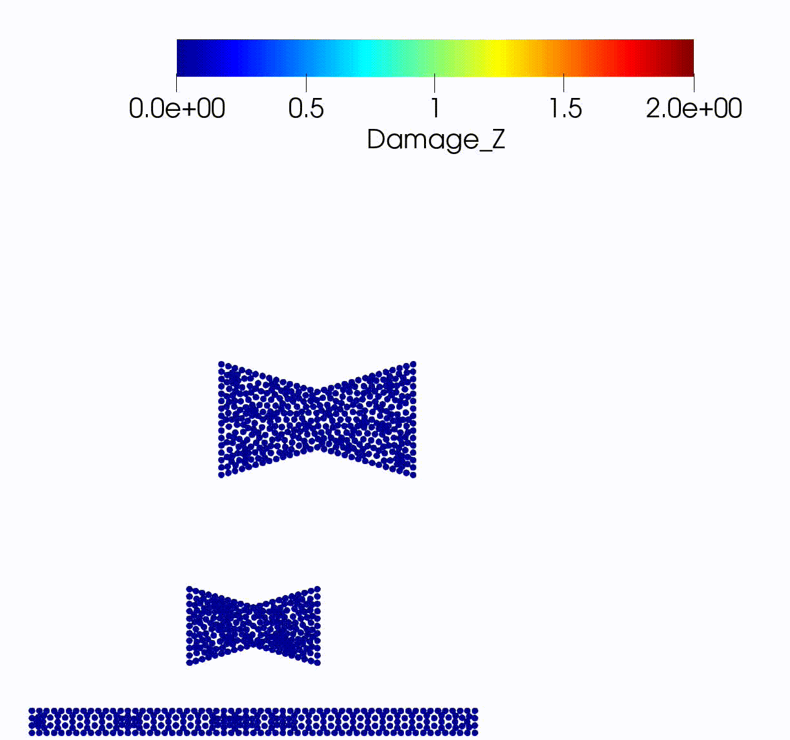   | 
|:------------------------------------------------------------------------------------------:| 
| Concave particles |

### Compressive tests

Paper setup (Jha et al. 2021): 502 circular and hexagonal particles in a rectangle
container; the top wall moves downward at fixed speed. Reaction on the moving wall rises
with penetration; damage then concentrates along force chains and the pack yields.
Runnable decks: small pack [n12](./examples/PeriDEM/compressive/n12) and paper-scale
two-stage [n500](./examples/PeriDEM/compressive/n500). Details:
[Jha et al. 2021](https://prashjha.github.io/publication/jha-2020-peridem/).

| 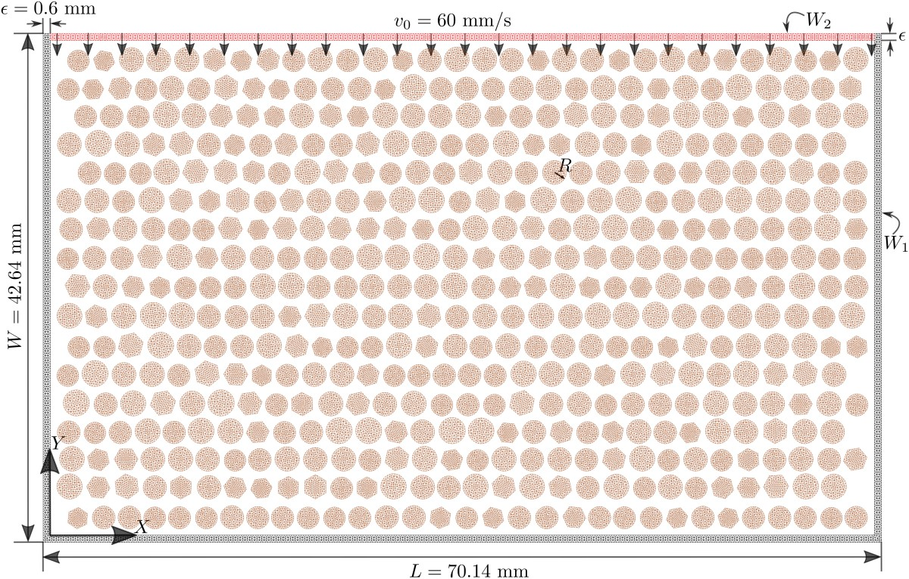 |  |
|:------------------------------------------------------------------:|:------------------------------------------------------------------------:|
| Pack geometry (N≈502) | Wall reaction and damage frames |

| 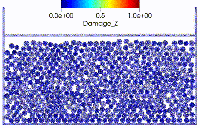 | 
|:-----------------------------------------------------:| 
| Compressive test simulation |

### Attrition tests

Mix of circular, triangular, hexagonal, and drum-shaped grains in a rotating container (size and toughness vary). Portable JSON decks:

|                                         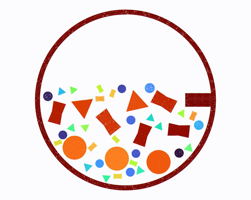                                         |                                                                              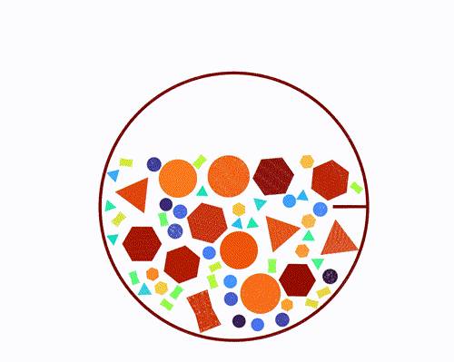                                                                               | 
|:----------------------------------------------------------------------------------------------------------------------------------------:|:-------------------------------------------------------------------------------------------------------------------------------------------------------------------------------------------------------------------:| 
| Rotating cylinder ([setup](./examples/PeriDEM/attrition/sim1_rotating_cylinder)) | Thin container, offset rotation ([setup](./examples/PeriDEM/attrition/sim2_thin_container)) | 

### Impact and fracture

| 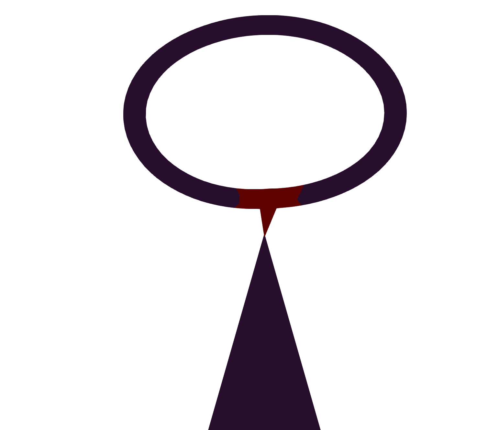 |
|:------------------------------------------------------------:|
| Hollow ellipse on a tip ([setup](./examples/PeriDEM/ellipse_triangle)) |

Silling KW notched plate (2D/3D scripts → notched-impact driver): [examples/PeriDEM/silling_kw](./examples/PeriDEM/silling_kw).

### Single particle deformation

`Model.Particle_Sim_Type = Single_Particle`. JSON demos: [examples/Peridynamics](./examples/Peridynamics).

| 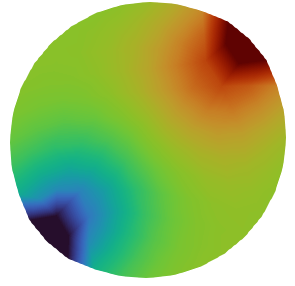 | 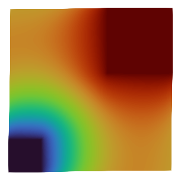 |
|:---------------------------------------------------------------:|:------------------------------------------------------------------:|
| Circle ([setup](./examples/Peridynamics/circle)) | Rectangle / `CreateMesh` ([setup](./examples/Peridynamics/rectangle)) |

## Brief implementation details

The simulation driver is class [PeriDEMModel](./PeriDEM/periDEMModel.cpp) in [PeriDEM/](./PeriDEM). Libraries live under `src/`. `PeriDEMModel::run()` initializes the simulation, optionally restarts, then hands the time loop to `time_int::Integrator`.

### PeriDEMModel::run()

```cpp
void PeriDEMModel::run(std::shared_ptr<inp::Input> &deck) {
    init();
    if (d_modelDeck_p->d_isRestartActive)
      restart(deck);
    integrate();  // time_int::Integrator().integrate(*this)
    close();
}
```

`init()` creates particles, sets up contact and quadrature data, builds neighbor lists and peridynamic bonds, and initializes loading.

### Time integration

`PeriDEMModel::integrate()` calls `time_int::Integrator`. The integrator applies initial conditions, displacement BCs, and forces, then advances with central difference or velocity Verlet using `data::ModelData` kinematics accessors. After each step it writes output and calls `checkStop()`.

### PeriDEMModel::computeForces()

```cpp
void PeriDEMModel::computeForces() {
    // reset nodal force
    pd::computeForces(*this);
    if (multi-particle)
      d_contact_p->computeForces(*this);
    computeExternalForces();
}
```

`Contact::computeForces` walks neighbors. The node-node relation is `contact::PairForce`; damping is `contact::Damping`. A different pair law is a `PairForce` subclass set with `Contact::setPairForce` — do not copy `contact.cpp`.

### Further reading

See [periDEMModel.cpp](./PeriDEM/periDEMModel.cpp), [src/time_int/integrator.h](./src/time_int/integrator.h), and [src/contact](./src/contact).

## Installation

The [pixi.toml](pixi.toml) file defines the dependencies and build instructions for the library. It should be used to create a reproducible environment and build the code using Pixi and CMake.

To install the Pixi package manager, follow the instructions at the official [installation page](https://pixi.sh/dev/installation/#update).

### Dependencies

Core dependencies are:
  - [cmake](https://cmake.org/) (>= 3.10.2) 
  - [vtk](https://vtk.org/) (>= 7.1.1)
  - [metis](https://github.com/KarypisLab/METIS) (>= 5.1.0)
  - MPI

Following dependencies are included in the `PeriDEM` library in `external` folder (see [external/README.md](./external/README.md) for more details):
  - [fast-cpp-csv-parser](https://github.com/ben-strasser/fast-cpp-csv-parser/tree/master) (version included - master)
  - [nanoflann](https://github.com/jlblancoc/nanoflann) (>= 1.3.2, version included - v1.5.5)
  - [taskflow](https://github.com/taskflow/taskflow) (>= 3.7.0)
  - [doxygen-awesome-css](https://github.com/jothepro/doxygen-awesome-css) (>= v2.3.3) 
  - [nlohmann_json](https://github.com/nlohmann/json) (>= 3.12.0)

### Pixi: Easiest method to build the library on ubuntu and mac

```sh
# run ubuntu using docker (we are using the same image we use to test the library)
docker run -it prashjha/peridem-base-noble

# we install pixi and add it to the path
curl -fsSL https://pixi.sh/install.sh | sh
export PATH="/root/.pixi/bin:$PATH"

# assuming we are now in root of docker image
cd user/
git clone git@github.com:prashjha/PeriDEM.git
cd PeriDEM/
pixi run test
```

### Building the code

If all the dependencies are installed on the global path (e.g., `/usr/local/`), 
commands for building the PeriDEM code is as simple as
```sh
cmake   -DEnable_Documentation=OFF
        -DEnable_Tests=ON \
        -DEnable_High_Load_Tests=OFF \
        -DDisable_Docker_MPI_Tests=ON \
        -DVTK_DIR="${VTK_DIR}" \
        -DMETIS_DIR="${METIS_DIR}" \
        -DCMAKE_BUILD_TYPE=Release \
        <PeriDEM source directory>
        
make -j 4
```

> :exclamation: `cmake` and `make` commands should be run inside the `build` 
directory. You can create the `build` directory either inside or outside the 
repository. 

### Install & use as a CMake package
- Build and install (starting from a fresh clone, e.g., `git clone ... && cd PeriDEM`; create a build dir wherever you like—`build` inside the source is assumed below):
  ```sh
  # from the source root
  mkdir -p build
  cmake -S . -B build -DCMAKE_BUILD_TYPE=Release
  cmake --build build -- -j$(sysctl -n hw.ncpu)

  # install library in /tmp/peridem-install
  cmake --install build --prefix /tmp/peridem-install
  ```
  This installs `bin/PeriDEM` (source: `PeriDEM/`), shared libs in `lib/`, headers in `include/`, and the CMake package files under `lib/cmake/PeriDEM`.
- Consume in another CMake project:
  ```cmake
  cmake_minimum_required(VERSION 3.18)
  project(peridem_consumer LANGUAGES CXX)
  find_package(PeriDEM REQUIRED)
  add_executable(hello main.cpp)
  target_link_libraries(hello PRIVATE PeriDEM::Model) # or another PeriDEM library target
  ```
  Place this in, e.g., `/tmp/peridem-consumer/CMakeLists.txt`. A minimal `main.cpp` in the same folder:
  ```cpp
  #include <iostream>
  #include <PeriDEMConfig.h>
  int main() {
    std::cout << "PeriDEM version: "
              << PERIDEM_VERSION_MAJOR << "."
              << PERIDEM_VERSION_MINOR << "."
              << PERIDEM_VERSION_PATCH << "\n";
  }
  ```
  Configure and build the consumer (run these inside `/tmp/peridem-consumer`):
  ```sh
  cmake -S . -B build -DCMAKE_PREFIX_PATH=/tmp/peridem-install
  cmake --build build -- -j$(sysctl -n hw.ncpu)
  ./build/hello
  ```
- External dependencies required on the target system: MPI, Threads, VTK (CommonCore/DataModel/IOXML), BLAS/LAPACK (Accelerate on macOS), Metis (found via bundled `FindMetis.cmake`), plus their transitive libraries. Ensure these are installed and discoverable (e.g., via `CMAKE_PREFIX_PATH` or system paths) when configuring consumers.

### Parallelism (MPI)

Decks are independent of MPI mode. Set `Model.MPI_Strategy` in the JSON input:

| Value | Meaning |
|-------|---------|
| `auto` (default) | Multi_Particle → Particle-MPI; Single_Particle → DOF-MPI |
| `none` | No domain split (`mpirun -n 1`) |
| `particle` | **Particle-MPI:** distribute whole particles across ranks |
| `dof` | **DOF-MPI:** distribute nodes/DOFs across ranks |

- **Particle-MPI:** each rank owns whole particles; near-contact and wall neighbors are exchanged as ghosts.
- **DOF-MPI:** each rank owns a subset of nodes (any body, including packs with walls). Before contact, Multi_Particle syncs owned nodal `u`/`v` to every rank.
- Threads (`-nThreads`) combine with MPI.

Identity checks (serial vs particle@2 vs dof@2) live under `test/test_data/peridem/twop_circ_inbuilt/`, `jha2021_comp_n50/`, and `mpi_identity_twop_wall/`.

Not covered here: GPU offload; larger-scale weak scaling. 

### Ask for help

Earlier releases depended on large libraries such as `HPX`, `PCL`, and `Boost`.
Those are gone. Current configure needs **VTK**, **MPI**, **Metis**, **Gmsh** (for
built-in meshing / some tests), and **BLAS/LAPACK** (Accelerate on macOS), plus a
C++20 toolchain. Use the scripts under `tools/compile_scripts/` or `pixi.toml` on
Ubuntu and macOS.

Feel free to reach out or open an issue. For more open 
discussion of issues and ideas, contact via 
[PeriDEM on Gitter](https://gitter.im/PeriDEM/community?utm_source=share-link&utm_medium=link&utm_campaign=share-link) 
or [PeriDEM on slack](peridem.slack.com) (for slack, email us to join). 
If you like some help, want to contribute, extend the code, or discuss new ideas, 
please do reach out to us.

## Running simulations

Input is **JSON only** (`bin/PeriDEM -i input.json`). Mesh files (`.msh`) and particle-location CSVs are referenced from the deck. Example:

```sh
<path of PeriDEM>/bin/PeriDEM -i input.json -nThreads 4
# or with MPI
mpirun -n 4 --quiet <path of PeriDEM>/bin/PeriDEM -i input.json -nThreads 2
```

Most example folders provide `./run.sh` (or `run_stage1.sh` / `run_stage2.sh`) that locate `bin/PeriDEM` under `build/`. Index: [examples/README.md](./examples/README.md).

### Deck layout (JSON)

A multi-particle deck has these top-level blocks:

| Block | Role |
|-------|------|
| `Model` | Dimension, time, `Particle_Sim_Type` (`Multi_Particle` / `Single_Particle`), `MPI_Strategy` |
| `Particle` / `Mesh` / `Material` | Geometry sets, meshes (`File` or `CreateMesh`), PD material |
| `Displacement_BC` / `Force_BC` | Regions, directions, time/space functions |
| `Contact` / `Neighbor` | Inter-particle (and wall) contact; neighbor list |
| `Particle_Generation` | Pack / container / wall placement when not listing every body by hand |
| `Output` | Path, tags (`Displacement`, `Velocity`, `Damage_Z`, …), optional `PVD_Collection` |
| `Restart` | Optional settled IC for two-stage runs |

Copy a short deck from `examples/PeriDEM/compressive/n12/` or `examples/Peridynamics/circle/` and change geometry, BCs, and time. Full block details: [Doxygen](https://prashjha.github.io/PeriDEM/) and the checked-in example JSON files.

### Two-particle contact

C++ driver example (shares the twop inbuilt test): [examples/PeriDEM/twop_circ_contact](./examples/PeriDEM/twop_circ_contact). For a JSON deck via `bin/PeriDEM`, start from compressive or attrition short decks, or the Peridynamics single-body demos.

### Compressive test

| Path | Role |
|------|------|
| [examples/PeriDEM/compressive/n12](./examples/PeriDEM/compressive/n12) | Small 4×3 pack; short / MPI identity decks |
| [examples/PeriDEM/compressive/n500](./examples/PeriDEM/compressive/n500) | Paper N≈502 two-stage settle → compress |

```sh
cd examples/PeriDEM/compressive/n12
./run.sh
DECK=input_quick_dof.json NP=4 ./run.sh

cd examples/PeriDEM/compressive/n500
NP=4 ./run_stage1.sh              # or use checked-in settled restart
NP=1 ./run_stage2.sh
```

### Attrition

| Path | Role |
|------|------|
| [attrition/sim1_rotating_cylinder](./examples/PeriDEM/attrition/sim1_rotating_cylinder) | Thick rotating drum |
| [attrition/sim2_thin_container](./examples/PeriDEM/attrition/sim2_thin_container) | Thin drum, offset rotation |

Each folder has `./run.sh` (and mesh/CSV setup scripts). Keep outputs under `runs/` (gitignored).

### Impact and fracture

| Path | Role |
|------|------|
| [ellipse_triangle](./examples/PeriDEM/ellipse_triangle) | Hollow ellipse dropped on a tip (C++ example + `./run.sh`) |
| [silling_kw](./examples/PeriDEM/silling_kw) | Silling KW 2D/3D via notched-impact driver scripts |

### Single-particle Peridynamics

| Path | Role |
|------|------|
| [Peridynamics/circle](./examples/Peridynamics/circle) | File mesh; fixed / pull BC |
| [Peridynamics/rectangle](./examples/Peridynamics/rectangle) | In-process `CreateMesh`; fixed / pull BC |

```sh
cd examples/Peridynamics/circle
./run.sh                          # short deck
DECK=input.json NP=2 ./run.sh     # full; auto → DOF-MPI on multi-rank
```

## Visualizing results

Simulation files `output_*.vtu` (and `output.pvd` when `PVD_Collection` is on) can be loaded in either [ParaView](https://www.paraview.org/) 
 or [VisIt](https://wci.llnl.gov/simulation/computer-codes/visit). 

By default, in all tests and examples, we only output the particle mesh, i.e., 
a pair of nodal coordinate and nodal volume, and not the finite element mesh 
(it can be enabled by setting `Perform_FE_Out` to `true` within the `Output` block in the JSON deck). 
After loading the file in ParaView, the first thing to do is to change the plot 
type from **`Surface`** to **`Point Gaussian`**. Next, a couple of things to do are:
  - Adjust the radius of circle/sphere at the nodes by going to the `Properties` 
    tab on the left side and change the value of **`Gaussian Radius`**
  - You may also want to choose the field to display. For starter, you could 
    select the `Damage_Z` variable, a ratio of **maximum bond strain in the neighborhood of a node and critical bond strain**. 
    When the `Damage_Z` value is below one at a given node, the deformation in 
    the vicinity of that node is elastic, whereas when the value is above 1, 
    it indicates there is at least one node in the neighborhood which has bond 
    strain above critical strain (meaning the bond between these two nodes is broken)
  - You may also need to rescale the plot by clicking on the **`Zoom to Data`** button in ParaView
  - Lastly, when the `Damage_Z` is very high at few nodes, you may want to rescale 
    the data to the range, say `[0,2]` or `[0,10]`, so that it is easier to identify 
    regions with elastic deformation and region with fracture.

## Contributing

We welcome contributions to the code. Limitations under [Parallelism (MPI)](#parallelism-mpi) are noted there.
Please fork this repository, make changes, and make a pull request to the 
source branch.  
 
## Citations

If this library was useful in your work, we recommend citing the following article:

> Jha, P.K., Desai, P.S., Bhattacharya, D. and Lipton, R., 2021. 
> **Peridynamics-based discrete element method (PeriDEM) model of granular systems involving breakage of arbitrarily shaped particles**. 
> *Journal of the Mechanics and Physics of Solids, 151*, p.104376.

You can also cite the PeriDEM using zenodo doi:

> Prashant K., J. (2024). Peridynamics-based discrete element method (PeriDEM) model of granular systems. Zenodo. https://doi.org/10.5281/zenodo.13888588

## Developers

  - [Prashant K. Jha](https://prashjha.github.io/) 
    (pjha.sci@gmail.com, prashant.jha@sdsmt.edu)
