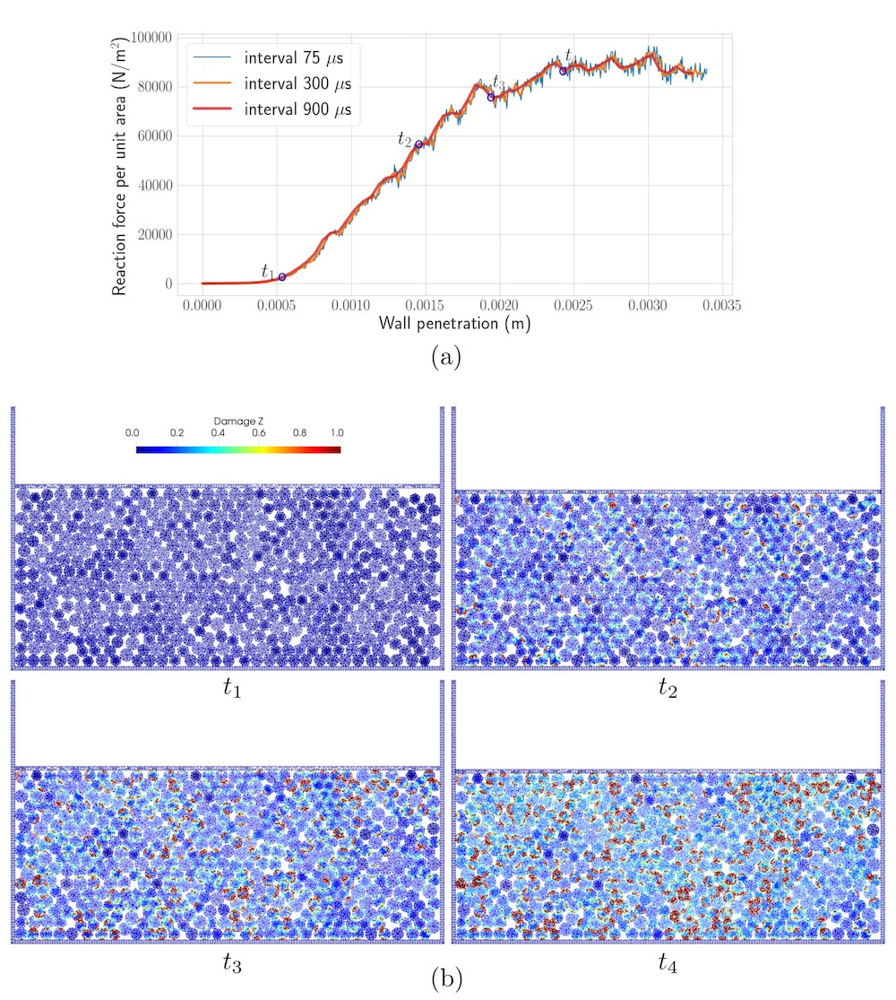

# PeriDEM - Peridynamics-based discrete element model of granular systems

[](https://app.codacy.com/gh/prashjha/PeriDEM?utm_source=github.com&utm_medium=referral&utm_content=prashjha/PeriDEM&utm_campaign=Badge_Grade_Settings) [](https://circleci.com/gh/prashjha/PeriDEM) [](https://codecov.io/gh/prashjha/PeriDEM) [](https://GitHub.com/prashjha/PeriDEM/releases/) [](https://github.com/prashjha/PeriDEM/blob/main/LICENSE) [](https://github.com/prashjha/PeriDEM/issues) [](https://gitter.im/PeriDEM/community?utm_source=badge&utm_medium=badge&utm_campaign=pr-badge&utm_content=badge) [](https://GitHub.com/prashjha/PeriDEM/) [](https://zenodo.org/badge/latestdoi/334516168)


<p align="center">  </p>

## Table of contents

  - [Introduction](#Introduction)
  - [Documentation](#Documentation)
  - [Tutorial](#Tutorial)
  - [Examples](#Examples)
  - [Brief implementation details](#Brief-implementation-details)
  - [Installation](#Installation)
    * [Dependencies](#Dependencies)
    * [Building the code](#Building-the-code)
    * [Recommendations for quick build](#Recommendations-for-quick-build)
  - [Running simulations](#Running-simulations)
    * [Two-particle with wall](#Two-particle-with-wall)
    * [Compressive test](#Compressive-test)
  - [Visualizing results](#Visualizing-results)
  - [Developers](#Developers)

## Introduction
Implementation of the high-fidelity model of granular media that combines the advantages of peridynamics and discrete element method (DEM). The model has the following advantages over existing mechanical models for granular media:
  - handle intra-particle deformation and breakage/damage
  - handle arbitrary shape of the particle. Inter-particle contact is not specific to any shape of the particle
  - tunable inter-particle contact parameters
  - easy to add different mechanical constitutive laws within peridynamics for individual particle deformation

For more details about the model and results, we refer to the paper:

> Prashant K. Jha, Prathamesh S. Desai, Debdeep Bhattacharya, Robert P Lipton (2020). **Peridynamics-based discrete element method (PeriDEM) model of granular systems involving breakage of arbitrarily shaped particles**. *Journal of the Mechanics and Physics of Solids, 151*, p.104376. Doi https://doi.org/10.1016/j.jmps.2021.104376.

Download pdf [here](https://prashjha.github.io/publication/jha-2020-peridem/jha-2020-peridem.pdf).

We have created channels on various platforms: 
- [PeriDEM on Gitter](https://gitter.im/PeriDEM/community?utm_source=share-link&utm_medium=link&utm_campaign=share-link)
  * Gitter is absolutely open and easy to join.
- [PeriDEM on slack](peridem.slack.com)
  * Send me an email if interested in joining the workspace.

## Documentation
Doxygen generated documentation of the code can be found [here](https://prashjha.github.io/PeriDEM/). Documentation will be improved in due time.

## Tutorial
We explain the setting-up of simulations in further details in [tutorial](tutorial/README.md). We consider `two-particle` test setup with non-circular particles and `compressive-test` setups to discuss the various aspects of simulations.

## Examples
We next highlight some key examples. For more details, look at the `create_input_file()` within `problem_setup.py` or `input_0.yaml` in [examples](https://github.com/prashjha/PeriDEM/blob/main/examples/PeriDEM).

To create input files, the python script is provided. Python script allows easy parameterization of various modeling and geometrical parameters and creating `.geo` files for `gmsh` and particle locations file. Typically, the input files consists of:

  - `input.yaml` - the main instruction file for `PeriDEM` with details about material models, particle geometries, time step, etc
  - `particle_locations.csv` - this file provides location and other details of the individual particles. Each row in the file consists of 
    * `i` - zone id that particle belongs to
    * `x` - x-coordinate of the center of the particle. Next two columns are similarly for `y` and `z` coordinates
    * `r` - radius of the particle 
    * `o` - orientation in radians. This is used to give particle (particle mesh) a rotation
  - `mesh.msh` - mesh file for the reference particle or wall. For example, in [compressive test](https://github.com/prashjha/PeriDEM/blob/main/examples/PeriDEM/compressive_test/n500_circ_hex/init_config/inp) example, there are four mesh files: one each for the circular and hexagon-shaped particle and one each for the fixed and mobile wall.

### Two-particle tests

|  |  |
| :---: | :---: |
| [Circular without damping](https://github.com/prashjha/PeriDEM/blob/main/examples/PeriDEM/two_particles/circ_no_damp/) | [Circular without damping](https://github.com/prashjha/PeriDEM/blob/main/examples/PeriDEM/two_particles/circ_damp/) |

|  |  |  |
| :---: | :---: | :---: |
| [Different materials](https://github.com/prashjha/PeriDEM/blob/main/examples/PeriDEM/two_particles/circ_diff_material/) | [Different radius](https://github.com/prashjha/PeriDEM/blob/main/examples/PeriDEM/two_particles/circ_damp_diff_radius/) | [Different radius different material](https://github.com/prashjha/PeriDEM/blob/main/examples/PeriDEM/two_particles/circ_diff_radius_diff_material/) |

### Two-particle with wall test

|  | 
| :---: | 
| [Concave particles](https://github.com/prashjha/PeriDEM/blob/main/examples/PeriDEM/two_particles_wall/concave_diff_material_diff_size/) |

### Compressive tests
Setup for this test consists of 502 circular and hexagonal-shaped particles of varying radius and orientation inside a rectangle container. The container's top wall is moving downward at a prescribed speed, resulting in the compression of the particle system. The quantity of interest is the compressive strength of the media. The reaction force (downward) on the moving wall should increase with the increasing penetration of this wall; however, after a certain amount of compression of the media, the damage will initiate in individual particles, especially those connected by force chains, resulting in the yielding of the system. For more details, we refer to [Jha et al. 2021](https://prashjha.github.io/publication/jha-2020-peridem/)

|  | 
| :---: | 
| [Compressive test setup](https://github.com/prashjha/PeriDEM/blob/main/examples/PeriDEM/compressive_test/n500_circ_hex/) |

|  | 
| :---: | 
| **Top**: Plot of reaction force per unit area on the top wall. **Bottom**: Particle state at four times. Color shows the damage at nodes. Damage 1 or above indicates the presence of broken bonds in the neighborhood of a node. |

|  | 
| :---: | 
| Compressive test simulation | 

## Brief implementation details
The main implementation of the model is carried out in the model directory [dem](https://github.com/prashjha/PeriDEM/blob/main/src/model/dem). The model is implemented in class `DEMModel`, see [demModel.cpp](https://github.com/prashjha/PeriDEM/blob/main/src/model/dem/demModel.cpp). Function `DEMModel::run()` performs the simulation. We next look at some key methods in `DEMModel` in more details:

### DEMModel::run()
This function does three tasks:
```c++
// initialize data
init();

// check for restart
if (d_modelDeck_p->d_isRestartActive)
  restart(deck);

// integrate in time
integrate();
```

In `DEMModel::init()`, the simulation is prepared by reading the input files (such as `.yaml`, `.msh`, `particle_locations.csv` files). 

### DEMModel::integrate()
Key steps in  `DEMModel::integrate()` are 
```c++
// apply initial condition
if (d_n == 0)
  applyInitialCondition();

// apply loading
computeExternalDisplacementBC();
computeForces();

// time step
for (size_t i = d_n; i < d_modelDeck_p->d_Nt; i++) {
  
  // advance simulation to next step
  integrateStep();
  
  // perform output if needed
  output();
} 
```

In `DEMModel::integrateStep()`, we either utilize the central-difference scheme, implemented in `DEMModel::integrateCD()`, or the velocity-verlet scheme, implemented in `DEMModel::integrateVerlet()`. As an example, we look at `DEMModel::integrateCD()` method below:
```c++
const auto dt = d_modelDeck_p->d_dt;
const auto dim = d_modelDeck_p->d_dim;

// update velocity and displacement
auto f = hpx::parallel::for_loop(
    hpx::parallel::execution::par(hpx::parallel::execution::task), 0,
    d_fPdCompNodes.size(),
    [this, dt, dim](boost::uint64_t II) {
      auto i = this->d_fPdCompNodes[II];

      const auto rho = this->getDensity(i);
      const auto &fix = this->d_fix[i];

      for (int dof = 0; dof < dim; dof++) {
        if (util::methods::isFree(fix, dof)) {
          this->d_v[i][dof] += (dt / rho) * this->d_f[i][dof];
          this->d_u[i][dof] += dt * this->d_v[i][dof];
          this->d_x[i][dof] += dt * this->d_v[i][dof];
        }
      }
    } // loop over nodes
);    // end of parallel for loop
f.get();

d_n++;
d_time += dt;

// update displacement bc
computeExternalDisplacementBC();

// compute force
computeForces();
```

### DEMModel::computeForces()
The key method in time integration is `DEMModel::computeForces()`. In this function, we compute internal and external forces at each node of a particle and also account for the external boundary conditions. This function looks like
```c++
// update tree for search
auto pt_cloud_update_time = d_nsearch_p->updatePointCloud(d_x, true);
pt_cloud_update_time += d_nsearch_p->setInputCloud();

// reset all forces (see file for details)

// compute peridynamic force (internal force)
computePeridynamicForces();

// compute contact force
computeContactForces();

// compute external force (e.g. due to container motion, etc)
computeExternalForces();
```

### Further reading
Above gives the basic idea of simulation steps. For more thorough understanding of the implementation, interested readers can look at [demModel.cpp](https://github.com/prashjha/PeriDEM/blob/main/src/model/dem/demModel.cpp).

## Installation

### Dependencies
Core dependencies are:
  - [cmake](https://cmake.org/) (3.10.2 or above) 
    * recommend to install using `apt-get`
  - [boost](https://www.boost.org/) (1.65.1)
    * recommend to install using `apt-get`
    * required for building YAML and HPX
  - [hwloc](https://github.com/open-mpi/hwloc) (1.11.9)
    * recommend to install using `apt-get`
    * required to build HPX library
  - [jemalloc](https://github.com/jemalloc/jemalloc) (3.6.0)
    * recommend to install using `apt-get`
    * required to build HPX library
  - [hpx](https://github.com/STEllAR-GROUP/hpx) (1.3.0)
    * use build script to install
    * used for multi-threading calculations
  - [vtk](https://vtk.org/) (7.1.1)
    * recommend to install using `apt-get`
    * required to output simulation results in `.vtu` format
  - [nanoflann](https://github.com/jlblancoc/nanoflann) (1.3.2)
    * included as external library in the code
    * required for neighbor search
  - [yaml-cpp](https://github.com/jbeder/yaml-cpp) (0.5.2)
    * recommend to install using `apt-get`
    * required to parse input file
  - [fmt](https://github.com/fmtlib/fmt) (7.1.3)
    * included as external library in the code
    * required to output formatted strings

Dependencies for running the examples:
  - [gmsh](https://gmsh.info/) (3.0.6)
    * recommend to install using `apt-get`
    * required to build the mesh of various objects in the test
  - [python3](https://www.python.org/)
    * required to run the test python scripts
  - [numpy](https://numpy.org/)
    * required to run the test python scripts

### Building the code
If all the dependencies are installed on the global path (e.g., `/usr/local/`), commands for building the PeriDEM code is as simple as
```sh
cmake   -DEnable_Documentation=ON \
        -DEnable_Tests=ON \
        -DCMAKE_BUILD_TYPE=Release \
        <PeriDEM source directory>

make -j 4
```

If HPX is installed on the custom paths, we will write
```sh
cmake   -DHPX_DIR="<hpx directory>/lib/cmake/HPX" \
        -DEnable_Documentation=ON \
        -DEnable_Tests=ON \
        -DCMAKE_BUILD_TYPE=Release \
        <PeriDEM source directory>

make -j 4
```

> :exclamation: Note that for HPX we provide `<hpx directory>/lib/cmake/HPX`, where `<hpx directory>` is the root paths of the location where HPX is installed. 


### Recommendations for quick build
1. Install most of the dependencies using `apt-get`:
```sh
sudo apt-get update 
  
sudo apt-get install -y build-essential ubuntu-dev-tools \
  git wget curl lzip \
  cmake autoconf libtool pkg-config \
  rpm gcovr ruby-coveralls \
  liblapack-dev libblas-dev libopenmpi-dev \
  doxygen doxygen-latex graphviz ghostscript \
  gfortran libmpfr-dev libgmp-dev \
  libhwloc-dev libjemalloc-dev libboost-all-dev libyaml-cpp-dev \
  libvtk7-dev gmsh python3-pip 

# pyvista and pandas are not required, so they can be excluded
pip3 install numpy pyvista pandas
```

> :zap: Above is also available in the bash script [install_base.sh](https://github.com/prashjha/PeriDEM/blob/main/tools/script/build_scripts/ubuntu-18.04/install_base.sh). 

2. Build hpx. For Ubuntu 18.04, you can use [install_libs.sh](https://github.com/prashjha/PeriDEM/blob/main/tools/script/build_scripts/ubuntu-18.04/install_libs.sh) script and run
```sh
./install_libs.sh
```

For Ubuntu 20.04, above script should work. You may also get some help from the script we used to build the base docker images. We installed HPX in docker image using the scripts:
  * [ubuntu 18.04 script](tools/script/docker/Dockerfile-u1804-comp) 
  * [ubuntu 20.04 script](tools/script/docker/Dockerfile-u2004-comp)

For mac the steps will be same assuming 
  - key dependencies are installed using homebrew instead of `apt-get`
```sh
brew install boost vtk yaml-cpp hwloc jemalloc cmake
```
  - HPX is installed similar to above

> :warning: With the recent update in homebrew where they changed the current version of the boost, I am no longer able to build the HPX in mac Big Sur 11.2.1. 

3. Build peridem using [install_peridem.sh](https://github.com/prashjha/PeriDEM/blob/main/tools/script/build_scripts/ubuntu-18.04/install_peridem.sh):
```sh
./install_peridem.sh
```

> :warning: Be sure to modify `install_peridem.sh` file to specify the correct paths where HPX is installed!

Alternatively, if you have already cloned the PeriDEM library and are in the root directory of PeriDEM, run following in the terminal:
```sh
mkdir build && cd build 
cmake   -DHPX_DIR="<hpx directory>/lib/cmake/HPX" \
        -DEnable_Documentation=ON \
        -DEnable_Tests=ON \
        -DCMAKE_BUILD_TYPE=Release \
        ../.

make -j 4

# ctest is optinal
ctest --verbose
```

### Docker
For `circle-ci` testing, we use docker images `prashjha/u1804-comp` and `prashjha/u2004-comp` of ubuntu 18.04 and 20.04. The associated dockerfiles and links to pull from docker hub are:
  - for ubuntu 18.04 
    * link: https://hub.docker.com/r/prashjha/u1804-comp
    * `docker pull prashjha/u1804-comp`
    * [dockerfile](tools/script/docker/Dockerfile-u1804-comp)
  - for ubuntu 20.04 
    * link: https://hub.docker.com/r/prashjha/u2004-comp
    * `docker pull prashjha/u2004-comp`
    * [dockerfile](tools/script/docker/Dockerfile-u2004-comp)
  - clion setup for remote development
  	* [dockerfile](tools/script/docker/Dockerfile-u1804-clion)

In [Packages](https://github.com/prashjha?tab=packages&repo_name=PeriDEM), docker images of PeriDEM are provided. They are built on ubuntu-18.04 (`prashjha/u1804-comp`) and ubuntu-20.04(`prashjha/u2004-comp`) images.

### Future plans to remove some dependencies
PeriDEM currently depends on four major libraries: Boost, VTK, HPX
  - Boost is not used directly but is required in building HPX and YAML-CPP 
  - If there are lightweight vtu writer and reader, dependency on VTK can be avoided
  - HPX is used for the multi-threading operation. Currently, HPX is a little troublesome to build, especially in clusters
  - Previously, we used PCL library for kd-tree search. We now use nanoflann for tree search making code free of PCL dependency.

### Ask for help
Because this library depends on complex libraries, it may get a little challenging to build it. If you carefully read the instructions, you should be able to compile PeriDEM in both ubuntu 18.04 and 20.04! For mac, as mentioned before, building this code is challenging, and we have not been successful yet. 

Still, if you are stuck, feel free to reach out or open an issue. For more open discussion of issues and ideas, contact via [PeriDEM on Gitter](https://gitter.im/PeriDEM/community?utm_source=share-link&utm_medium=link&utm_campaign=share-link) or [PeriDEM on slack](peridem.slack.com) (for slack, send me an email to join). If you like some help, want to contribute, extend the code, or discuss new ideas, please reach out.

## Running simulations
Assuming that the input file is `input.yaml` and all other files such as `.msh` file for particle/wall and particle locations file are created and their filenames with paths are correctly provided in `input.yaml`, we will run the problem (using 4 threads) 
```sh
<path of PeriDEM>/bin/PeriDEM -i input.yaml --hpx:threads=4
```

Some examples are listed below.

### Two-particle with wall
Navigate to the example directory `examples/PeriDEM/two_particles_wall/concave_diff_material_diff_size/inp` and run the example as follows
```sh
mkdir ../out # <-- make directory for simulation output. In .yaml, we specify output path as './out'
<peridem build path>bin/PeriDEM -i input_0.yaml --hpx:threads=2
```

You may also use the included [problem_setup.py](https://github.com/prashjha/PeriDEM/blob/main/examples/PeriDEM/two_particles_wall/concave_diff_material_diff_size/inp/problem_setup.py) to modify simulation parameters and run the simulation using [run.sh](https://github.com/prashjha/PeriDEM/blob/main/examples/PeriDEM/two_particles_wall/concave_diff_material_diff_size/run.sh) (in directoy `examples/PeriDEM/two_particles_wall/concave_diff_material_diff_size`). `run.sh` shows how different input files are created for the simulation.

> :exclamation: You will need to modify the path of `PeriDEM` executible in `run.sh` file, see variable `execsrc`. 


> In all `problem_setup.py` files in the example and test directory, the main function is `create_input_file()`. Here we set all model parameters, create `.yaml` input file, and `.geo` files for meshing.

#### Important remark on modifying input.yaml file
To test the examples quickly, you can directly modify the `input.yaml` and re-run the simulation as shown above. For example, you can alter `Final_Time`, `Time_Steps`, `Contact_Radius_Factor`, `Kn`, and other fields in the yaml file. 

However, some care is required when changing the geometrical details of particles and walls in the `input.yaml` file. If you change these details in the `.yaml` file, you will have to ensure that the `.msh` file correspond to the new geometry. 

Except geometrical parameters of walls and particles, rest of the parameters in `input.yaml` can be modified.

> In due time, we will provide more information on setting up input files and covering all aspects of the simulation.

### Compressive test
Navigate to the example directory `examples/PeriDEM/compressive_test/n500_circ_hex/run1/inp` and run the example as follows (note that this is an expensive example)
```sh
mkdir ../out 
<peridem build path>bin/PeriDEM -i input_0.yaml --hpx:threads=12
```

As before:
  - you can modify [problem_setup.py](https://github.com/prashjha/PeriDEM/blob/main/examples/PeriDEM/compressive_test/n500_circ_hex/run1/inp/problem_setup.py), see `create_input_file()` method, to change the simulation settings 
  - run the simulation using [run.sh](https://github.com/prashjha/PeriDEM/blob/main/examples/PeriDEM/compressive_test/n500_circ_hex/run1/run.sh) (in directory `examples/PeriDEM/compressive_test/n500_circ_hex/run1`).

### Compute times for various examples
For reference, we list the compute times for various examples.
  - `T` is the total compute time in units of `second`
  - `T(n)` means compute time when running the example with `n` threads.

| Test | T(1) | T(2) | T(4) | T(8) |
| :--- | :---: |  :---: |  :---: |  :---: |
| two_particles/circ_damp | 143.7 | 95.1 | 76.4 | 78.6 |
| two_particles/circ_damp_diff_radius | 164 | 114.6 | 96.7 | 99.4 |
| two_particles/circ_diff_material | 287.7 | 190.1 | 152.7 | 160 |
| two_particles/circ_diff_radius_diff_material | 329.1 | 229.4 | 195.3 | 200 |
| two_particles/circ_no_damp | 143.8 | 94.5 | 76.7 | 78.5 |
| two_particles_wall/concave_diff_material_diff_size | 2749.9 | 1534.6 | 980.8 | 691.1 |

## Visualizing results
Simulation files `output_*.vtu` can be loaded in either [ParaView](https://www.paraview.org/) (tested on 5.4.1 and later version) or [VisIt](https://wci.llnl.gov/simulation/computer-codes/visit) (tested on 2.13.3). 

By default, in all tests and examples, we only output the particle mesh, i.e., pair of nodal coordinate and nodal volume, and not the finite element mesh (it can be enabled by setting `Perform_FE_Out: true` within `Output` block in the input `yaml` file). After loading the file in ParaView, the first thing to do is to change the plot type from **`Surface`** to **`Point Gaussian`**. Next, a couple of things to do are:
  - Adjust the radius of circle/sphere at the nodes by going to the `Properties` tab on the left side and change the value of **`Gaussian Radius`**
  - You may also want to choose the field to display. For starter, you could select the `Damage_Z` variable, a ratio of **maximum bond strain in the neighborhood of a node and critical bond strain**. When the `Damage_Z` value is below one at a given node, the deformation in the vicinity of that node is elastic, whereas when the value is above 1, it indicates there is at least one node in the neighborhood which has bond strain above critical strain (meaning the bond between these two nodes is broken)
  - You may also need to rescale the plot by clicking on the **`Zoom to Data`** button in ParaView
  - Lastly, when the `Damage_Z` is very high at few nodes, you may want to rescale the data to the range, say `[0,2]` or `[0,10]`, so that it is easier to identify regions with elastic deformation and region with fracture.
 
## Citations
If this library was useful in your work, we recommend citing the following article:

> Jha, P.K., Desai, P.S., Bhattacharya, D. and Lipton, R., 2021. **Peridynamics-based discrete element method (PeriDEM) model of granular systems involving breakage of arbitrarily shaped particles**. *Journal of the Mechanics and Physics of Solids, 151*, p.104376.

You can also cite the PeriDEM using zenodo doi:

> http://doi.org/10.5281/zenodo.4733259

## Developers
  - [Prashant K. Jha](https://prashjha.github.io/) (pjha.sci@gmail.com, pjha@utexas.edu)
