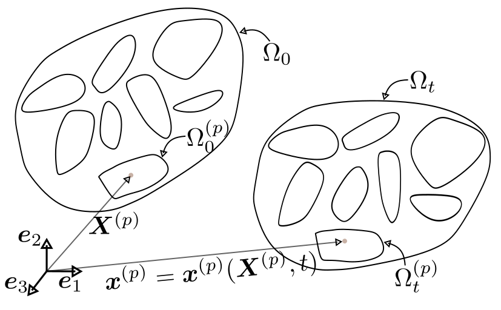

# Summary

Accurate simulation of granular materials under extreme mechanical conditions, such as crushing, fracture, and large deformation, remains a significant challenge in geotechnical, manufacturing, and mining applications. Classical discrete element method (DEM) models typically treat particles as rigid or nearly rigid bodies, limiting their ability to capture internal deformation and fracture. The PeriDEM library, first introduced in [@jha2021peridynamics], addresses this limitation by modeling particles as deformable solids using peridynamics, a nonlocal continuum theory that naturally accommodates fracture and significant deformation. Inter-particle contact is handled using DEM-inspired local laws, enabling realistic interaction between complex-shaped particles.

Implemented in C++, PeriDEM is designed for extensibility and ease of deployment. It relies on a minimal set of external libraries, supports multithreaded execution, and includes demonstration examples involving compaction, fracture, and rotational dynamics. The framework facilitates granular-scale simulations, supports the development of constitutive models, and serves as a foundation for multi-fidelity coupling in real-world applications.

# Statement of Need

Granular materials play a central role in many engineered systems, but modeling their behavior under high loading, deformation, and fragmentation remains an open problem. Popular open-source DEM codes such as YADE [@yade2021], BlazeDEM [@govender2016blaze], Chrono DEM-Engine [@zhang_2024_deme], and LAMMPS [@THOMPSON2022108171] are widely used but typically treat particles as rigid, limiting their accuracy in scenarios involving internal deformation and breakage. A recent review by Dosta et al. [@dosta2024comparing] compares several DEM libraries. Meanwhile, peridynamics-based codes such as Peridigm [@littlewood2024peridigm] and NLMech [@Jha2021] are designed to simulate deformation and fracture within a single structure, with limited support for multi-structure simulations. 

PeriDEM fills this gap by integrating state-based peridynamics for intra-particle deformation with DEM-style contact laws for particle interactions. This hybrid approach enables direct simulation of particle fragmentation, stress redistribution, and dynamic failure propagation—capabilities essential for modeling granular compaction, attrition, and crushing.

Recent multiscale approaches, including DEM-continuum and DEM-level-set coupling methods [@harmon2021modeling], aim to bridge scales but often rely on homogenization assumptions. Sand crushing in geotechnical systems, for example, has been modeled using micro-CT-informed FEM or phenomenological laws [@chen2023mechanical]. PeriDEM offers a particle-resolved alternative that allows bottom-up investigation of granular failure and shape evolution, especially in systems where fragment dynamics are critical.

# Background

The PeriDEM model was introduced in [@jha2021peridynamics], demonstrating its ability to model inter-particle contact and intra-particle fracture for complex-shaped particles. It is briefly described next.

## Brief Introduction to PeriDEM Model

{width=50%}

Consider a fixed frame of reference and $\{\boldsymbol{e}_i\}_{i=1}^d$ are orthonormal bases. Consider a collection of $N_P$ particles ${\Omega}^{(p)}_0$, $1\leq p \leq N_P$, where ${\Omega}^{(p)}_0 \subset \mathbb{R}^d$ with $d=2,3$ represents the initial configuration of particle $p$. Suppose $\Omega_0 \supset \cup_{p=1}^{N_P} {\Omega}^{(p)}_0$ is the domain containing all particles; see \autoref{fig:schemMultiParticles}. The particles in $\Omega_0$ are dynamically evolving due to external boundary conditions and internal interactions; let ${\Omega}^{(p)}_t$ denote the configuration of particle $p$ at time $t\in (0, t_F]$, and $\Omega_t \supset \cup_{p=1}^{N_P} {\Omega}^{(p)}_t$ domain containing all particles at that time. The motion ${\boldsymbol{x}}^{(p)} = {\boldsymbol{x}}^{(p)}({\boldsymbol{X}}^{(p)}, t)$ takes point ${\boldsymbol{X}}^{(p)}\in {\Omega}^{(p)}_0$ to ${\boldsymbol{x}}^{(p)}\in {\Omega}^{(p)}_t$, and collectively, the motion is given by $\boldsymbol{x} = \boldsymbol{x}(\boldsymbol{X}, t) \in \Omega_t$ for $\boldsymbol{X} \in \Omega_0$. We assume the media is dry and not influenced by factors other than mechanical loading (e.g., moisture and temperature are not considered). The configuration of particles in $\Omega_t$ at time $t$ depends on various factors, such as material and geometrical properties, contact mechanism, and external loading. 
Essentially, there are two types of interactions present in the media:

- *Intra-particle interaction* that models the deformation and internal forces in the particle and
- *Inter-particle interaction* that accounts for the contact between particles and the boundary of the domain in which the particles are contained.

In DEM, the first interaction is ignored, assuming that particle deformation is insignificant compared to inter-particle interactions. On the other hand, PeriDEM accounts for both interactions.

The balance of linear momentum for particle $p$, $1\leq p\leq N_P$, takes the form:
\begin{equation}
 {\rho}^{(p)} {\ddot{\boldsymbol{u}}}^{(p)}(\boldsymbol{X}, t) = {\boldsymbol{f}}^{(p)}_{int}(\boldsymbol{X}, t) + {\boldsymbol{f}}^{(p)}_{ext}(\boldsymbol{X}, t), \qquad \forall (\boldsymbol{X}, t) \in {\Omega}^{(p)}_0 \times (0, t_F)\,,
\end{equation}
where ${\rho}^{(p)}$, ${\boldsymbol{f}}^{(p)}_{int}$, and ${\boldsymbol{f}}^{(p)}_{ext}$ are density, and internal and external force densities. The above equation is complemented with initial conditions, ${\boldsymbol{u}}^{(p)}(\boldsymbol{X}, 0) = {\boldsymbol{u}}^{(p)}_0(\boldsymbol{X}), {\dot{\boldsymbol{u}}}^{(p)}(\boldsymbol{X}, 0) = {\dot{\boldsymbol{u}}}^{(p)}_0(\boldsymbol{X}), \boldsymbol{X} \in {\Omega}^{(p)}_0$. 

### Internal force - State-based peridynamics

The internal force term ${\boldsymbol{f}}^{(p)}_{int}(\boldsymbol{X}, t)$ in the momentum balance governs intra-particle deformation and fracture. In PeriDEM, this term is modeled using a simplified state-based peridynamics formulation that accounts for nonlocal interactions over a finite horizon. The specific constitutive structure used—including damage-driven bond weakening, volumetric strain contributions, and neighbor-weighted quadrature—is discussed in detail in [@jha2021peridynamics, Sections 2.1 and 2.3]. This formulation allows unified simulation of deformation and fracture in individual particles. 

### DEM-inspired contact forces

{width=40%}

The external force term ${\boldsymbol{f}}^{(p)}_{ext}(\boldsymbol{X}, t)$ includes body forces, wall-particle interactions, and contact forces from other particles. Contact is modeled using a spring-dashpot-slider formulation applied locally when particles come within a critical distance. This approach introduces nonlinear normal forces, damping, and friction without relying on particle convexity or simplified geometries. \autoref{fig:peridemContact} illustrates the local high-resolution contact approach between deformable particles. The full formulation of contact detection, force assembly, and its implementation is provided in [@jha2021peridynamics, Section 2.2]. 

# Implementation

[PeriDEM](https://github.com/prashjha/PeriDEM) is implemented in C++ and hosted on GitHub. It depends on a minimal set of external libraries, most of which are bundled in the `external` directory. Some of the key dependencies include Taskflow [@huang2021taskflow] for multithreaded parallelism, nanoflann [@blanco2014nanoflann] for efficient neighborhood search, and VTK for output and post-processing. The numerical strategies for neighbor search, peridynamic integration, damage evaluation, and time stepping follow those introduced in [@jha2021peridynamics, Section 3], where additional implementation details and validation are discussed. The core simulation model is implemented in [`src/model/dem`](https://github.com/prashjha/PeriDEM/blob/v0.2.1/src/model/dem), with the class [`DEMModel`](https://github.com/prashjha/PeriDEM/blob/v0.2.1/src/model/dem/demModel.cpp) managing particle states, force calculations, and time integration.

This work builds on earlier research in the analysis and numerical methods for peridynamics; see [@jha2018numerical; @jha2019numerical; @jha2018numerical2; @Jha2020peri; @lipton2019complex].

## Features
- Hybrid modeling using peridynamics and DEM for intra-particle and inter-particle interactions  
- Simulation of deformation and breakage of a single particle under complex boundary conditions  
- Support for arbitrarily shaped particles, allowing for realistic simulation scenarios  
- Ongoing integration of MPI for distributed computing  
- Planned development of adaptive modeling strategies to enhance efficiency without compromising accuracy

## Examples

{width=60%}

Examples are described in [examples/README.md](https://github.com/prashjha/PeriDEM/blob/v0.2.1/examples/README.md). One key case demonstrates compression of 500+ circular and hexagonal particles in a rectangular container by moving the top wall. The stress on the wall as a function of penetration becomes increasingly nonlinear as damage accumulates and the medium yields; see \autoref{fig:peridemSummary}a. Preliminary performance tests show an exponential increase in compute time with the number of particles, due to the nonlocal nature of both peridynamic and contact forces, highlighting a computational bottleneck. This motivates the integration of MPI and the development of a multi-fidelity framework. Additional examples include attrition of non-circular particles in a rotating cylinder (\autoref{fig:peridemSummary}c).

# Acknowledgements

This work was supported by the U.S. National Science Foundation through the Engineering Research Initiation (ERI) program under Grant No. 2502279. The support has contributed to the continued development and enhancement of the PeriDEM library.

# References
