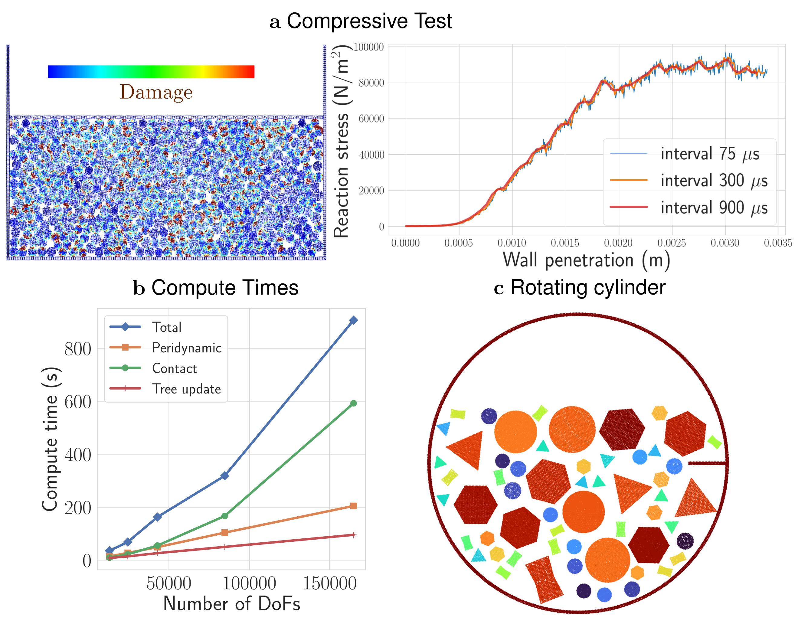

# Summary

Modeling dynamics of deformning and breaking particles interacting with each other is a challenging task from both mechanistic modeling and simulation point of views. The PeriDEM library implements a hybrid approach combining peridynamics and the discrete element method (DEM), providing a means to simulate the intricate behaviors of granular systems involving arbitrarily shaped particles and particle breakage. The PeriDEM framework integrates the strengths of DEM, which effectively captures inter-particle contact forces, with peridynamics, which can model intra-particle deformation and fracture. This hybrid approach is particularly suited for scenarios involving extreme conditions such as high-stress environments where particle deformation and breakage play significant roles.

# Statement of Need

Granular materials are prevalent in numerous industrial sectors, including geotechnical, manufacturing, mining engineering, and pharmaceutics. Current modeling techniques such as DEM struggle with accurately capturing the behavior of granular materials under extreme conditions, especially when dealing with complex geometries and deformable particles.  PeriDEM implements a high-fidelity framework combining DEM and peridynamics to allow for accurate simulations of granular systems under extreme loading conditions. 

# Background

PeriDEM model was introduced in [@jha2021peridynamics], where it demonstrated the ability to model both inter-particle contact and intra-particle fracture for arbitrarily shaped particles. The underlying basic idea is that individual particles are modeled as deformable solid using peridynamics theory, and the contact between two deforming particles are applied at locally at the contact region allowing modeling of complex-shaped particles. The integration of peridynamics within DEM provides a flexible, hybrid framework that handles the contact mechanics at the particle boundary while accounting for the internal material response, including deformation and fracture. This opens up new avenues for exploring the interactions in granular systems, including developing constitutive laws for phenomenological continuum models, understanding effective behavior when subjected to large loading, and impact of particle shape on particle dynamics. 

## Brief Introduction to PeriDEM Model

{width=30%}

Suppose a fixed frame of reference and $\{\boldsymbol{e}_i\}_{i=1}^d$ are orthonormal bases. Consider a collection of $N_P$ particles ${\Omega}^{(p)}_0$, $1\leq p \leq N_P$, where ${\Omega}^{(p)}_0 \subset \mathbb{R}^d$ with $d=2,3$ represents the initial configuration of particle $p$. Suppose $\Omega_0 \supset \cup_{p=1}^{N_P} {\Omega}^{(p)}_0$ is the domain containing all particles; see \autoref{fig:schemMultiParticles}. The particles in $\Omega_0$ are dynamically evolving due to external boundary conditions and internal interactions; let ${\Omega}^{(p)}_t$ denote the configuration of particle $p$ at time $t\in (0, t_F]$, and $\Omega_t \supset \cup_{p=1}^{N_P} {\Omega}^{(p)}_t$ domain containing all particles at that time. The motion ${\boldsymbol{x}}^{(p)} = {\boldsymbol{x}}^{(p)}({\boldsymbol{X}}^{(p)}, t)$ takes point ${\boldsymbol{X}}^{(p)}\in {\Omega}^{(p)}_0$ to ${\boldsymbol{x}}^{(p)}\in {\Omega}^{(p)}_t$, and collectively, the motion is given by $\boldsymbol{x} = \boldsymbol{x}(\boldsymbol{X}, t) \in \Omega_t$ for $\boldsymbol{X} \in \Omega_0$. We assume the media is dry and not influenced by factors other than mechanical loading (e.g., moisture and temperature are not considered). The configuration of particles in $\Omega_t$ at time $t$ depends on various factors, such as material and geometrical properties, contact mechanism, and external loading. 
Essentially, there are two types of interactions present in the media:
\begin{itemize}
    \item[(1.)] {\it Intra-particle interaction} that models the deformation and internal forces in the particle and
    \item[(2.)] {\it Inter-particle interaction} that accounts for the contact between particles and the boundary of the domain the particles are contained in.
\end{itemize}
In DEM, the first interaction is ignored, assuming particle deformation is insignificant compared to the inter-particle interaction. On the other hand, PeriDEM, accounts for both interactions and is summarized next.

The balance of linear momentum for particle $p$, $1\leq p\leq N_P$, takes the form:
\begin{equation}
    {\rho}^{(p)} {\ddot{\boldsymbol{u}}}^{(p)}(\boldsymbol{X}, t) = {\boldsymbol{f}}^{(p)}_{int}(\boldsymbol{X}, t) + {\boldsymbol{f}}^{(p)}_{ext}(\boldsymbol{X}, t), \qquad \forall (\boldsymbol{X}, t) \in {\Omega}^{(p)}_0 \times (0, t_F)\,,
\end{equation}
where ${\rho}^{(p)}$, ${\boldsymbol{f}}^{(p)}_{int}$, and ${\boldsymbol{f}}^{(p)}_{ext}$ are density, and internal and external force densities. The above equation is complemented with initial conditions, ${\boldsymbol{u}}^{(p)}(\boldsymbol{X}, 0) = {\boldsymbol{u}}^{(p)}_0(\boldsymbol{X}), {\dot{\boldsymbol{u}}}^{(p)}(\boldsymbol{X}, 0) = {\dot{\boldsymbol{u}}}^{(p)}_0(\boldsymbol{X}), \boldsymbol{X} \in {\Omega}^{(p)}_0$. 

### Internal force - State-based peridynamics

Since all expressions in this paragraph are for a fixed particle $p$, we drop the superscript $p$, noting that material properties and other quantities can depend on the particle $p$.
Following [@silling2007peridynamic] and simplified expression of state-based peridynamics force in [@jha2021peridynamics], the internal force takes the form, for $\boldsymbol{X} \in {\Omega}^{(p)}_0$,
\begin{equation}
    {\boldsymbol{f}}^{(p)}_{int}(\boldsymbol{X}, t) = \int_{B_{\epsilon}(\boldsymbol{X}) \cap {\Omega}^{(p)}_0} \left( \boldsymbol{T}_{\boldsymbol{X}}(\boldsymbol{Y}) - \boldsymbol{T}_{\boldsymbol{Y}}(\boldsymbol{X}) \right) \, \mathrm{d} \boldsymbol{Y}\,,
\end{equation}
where $\boldsymbol{T}_{\boldsymbol{X}}(\boldsymbol{Y}) - \boldsymbol{T}_{\boldsymbol{Y}}(\boldsymbol{X})$ is the force on $\boldsymbol{X}$ due to nonlocal interaction with $\boldsymbol{Y}$. Let $R = |\boldsymbol{Y} - \boldsymbol{X}|$ be the reference bond length, $r = |\boldsymbol{x}(\boldsymbol{Y}) - \boldsymbol{x}(\boldsymbol{X})|$ current bond length, $s(\boldsymbol{Y}, \boldsymbol{X}) = (r - R)/R$ bond strain, then $\boldsymbol{T}_{\boldsymbol{X}}(\boldsymbol{Y})$ is given by [@silling2007peridynamic, @jha2021peridynamics]
\begin{equation}
    \boldsymbol{T}_{\boldsymbol{X}}(\boldsymbol{Y}) = h(s) J(R/\epsilon)\, \left[R \theta_{\boldsymbol{X}} \left(\frac{3\kappa}{m_{\boldsymbol{X}}} - \frac{15 G}{3 m_{\boldsymbol{X}}}\right) + (r - R) \frac{15 G}{m_{\boldsymbol{X}}}\right] \frac{\boldsymbol{x}(\boldsymbol{Y}) - \boldsymbol{x}(\boldsymbol{X})}{|\boldsymbol{x}(\boldsymbol{Y}) - \boldsymbol{x}(\boldsymbol{X})|}\,,
\end{equation}
where
\begin{equation}
    \begin{split}
        m_{\boldsymbol{X}} &= \int_{B_\epsilon(\boldsymbol{X}) \cap {\Omega}^{(p)}_0} R^2 J(R/\epsilon) \, \mathrm{d} \boldsymbol{Y}\,,\\
        \theta_{\boldsymbol{X}} &= h(s) \frac{3}{m_{\boldsymbol{X}}} \int_{B_\epsilon(\boldsymbol{X}) \cap {\Omega}^{(p)}_0} (r - R) \, R \, J(R/\epsilon) \, \mathrm{d} \boldsymbol{Y}\,,\\
        h(s) &= \begin{cases}
            1\,, &\qquad \text{if } s < s_0 := \sqrt{\frac{\mathcal{G}_c}{\left(3 G + (3/4)^4 \left[\kappa - 5G/3\right]\right)\epsilon}}\,, \\
            0\,, & \qquad \text{otherwise}\,.
        \end{cases}
    \end{split}
\end{equation}
In the above, $J: [0, \infty) \to \mathbb{R}$ is the influence function, $\kappa, G, \mathcal{G}_c$ are bulk and shear moduli and critical energy release rate, respectively. These parameters, including nonlocal length scale $\epsilon$, could depend on the particle $p$.

### DEM-inspired contact forces
The external force density ${\boldsymbol{f}}^{(p)}_{ext}$ is generally expressed as
\begin{equation}
    {\boldsymbol{f}}^{(p)}_{ext} = {\rho}^{(p)}\boldsymbol{b} + \boldsymbol{f}^{\Omega_0, (p)} + \sum_{q\neq p} {\boldsymbol{f}}^{(q),(p)}\,,
\end{equation}
where $\boldsymbol{b}$ is body force per unit mass, $\boldsymbol{f}^{\Omega_0, (p)}$ and ${\boldsymbol{f}}^{(q),(p)}$ are contact forces due to interaction between particle $p$ and container $\Omega_0$ and neighboring particles $q$, respectively. In [@jha2021peridynamics, @jha2024peridynamics], the contact between two particles is applied locally where the contact takes place; this is exemplified in \autoref{fig:peridemContact} where contact between points $\boldsymbol{y}$ and $\boldsymbol{x}$ of two distinct particles $p$ and $q$ is activated when they get sufficiently close. The contact forces are shown using a spring-dashpot-slider system. To fix the contact forces, consider a point $\boldsymbol{X}\in {\Omega}^{(p)}_0$ and let ${R}^{(q),(p)}_c$ be the critical contact radius (points in particles $p$ and $q$ interact if the distance is below this critical distance). Further, define the relative distance between two points $\boldsymbol{Y} \in {\Omega}^{(q)}_0$ and $\boldsymbol{X} \in {\Omega}^{(p)}$ and normal and tangential directions as follows:
\begin{equation}
    \begin{split}
        {\Delta}^{(q),(p)}(\boldsymbol{Y}, \boldsymbol{X}) &= \vert {\boldsymbol{x}}^{(q)}(\boldsymbol{Y}) - {\boldsymbol{x}}^{(p)}(\boldsymbol{X}) \vert - {R}^{(q),(p)}_c\,, \\
        {\boldsymbol{e}}^{(q),(p)}_N(\boldsymbol{Y}, \boldsymbol{X}) &= \frac{{\boldsymbol{x}}^{(q)}(\boldsymbol{Y}) - {\boldsymbol{x}}^{(p)}(\boldsymbol{X})}{\vert {\boldsymbol{x}}^{(q)}(\boldsymbol{Y}) - {\boldsymbol{x}}^{(p)}(\boldsymbol{X}) \vert}\,, \\
        {\boldsymbol{e}}^{(q),(p)}_T(\boldsymbol{Y}, \boldsymbol{X}) &= \left[ \boldsymbol{I} - {\boldsymbol{e}}^{(q),(p)}_N(\boldsymbol{Y}, \boldsymbol{X}) \otimes {\boldsymbol{e}}^{(q),(p)}_N(\boldsymbol{Y}, \boldsymbol{X}) \right]\frac{{\dot{\boldsymbol{x}}}^{(q)}(\boldsymbol{Y}) - {\dot{\boldsymbol{x}}}^{(p)}(\boldsymbol{X})}{\vert {\dot{\boldsymbol{x}}}^{(q)}(\boldsymbol{Y}) - {\dot{\boldsymbol{x}}}^{(p)}(\boldsymbol{X}) \vert} \,.
    \end{split}
\end{equation}
Then the force on particle $p$ due to contact with particle $q$ can be written as [@jha2021peridynamics}]:
\begin{equation}
    {\boldsymbol{f}}^{(q),(p)} (\boldsymbol{X}, t) = \int_{\boldsymbol{Y} \in {\Omega}^{(q)}_0 \cap B_{{R}^{(q),(p)}}(\boldsymbol{X})} \left( {\boldsymbol{f}}^{(q),(p)}_N(\boldsymbol{Y}, \boldsymbol{X}) + {\boldsymbol{f}}^{(q),(p)}_T(\boldsymbol{Y}, \boldsymbol{X}) \right)\, \mathrm{d} \boldsymbol{Y}\,,
\end{equation}
with normal and tangential forces following [@jha2021peridynamics, @desai2019rheometry] given by
\begin{equation}
    {\boldsymbol{f}}^{(q),(p)}_N(\boldsymbol{Y}, \boldsymbol{X}) = 
        \left[ {\kappa}^{(q),(p)}_N {\Delta}^{(q),(p)}(\boldsymbol{Y}, \boldsymbol{X}) - {\beta}^{(q),(p)}_N {\dot{\Delta}}^{(q),(p)}(\boldsymbol{Y}, \boldsymbol{X})  \right]\,, 
\end{equation}
if ${\Delta}^{(q),(p)}(\boldsymbol{Y}, \boldsymbol{X}) < 0$ else ${\boldsymbol{f}}^{(q),(p)}_N(\boldsymbol{Y}, \boldsymbol{X}) = \boldsymbol{0}$, and
\begin{equation}
    {\boldsymbol{f}}^{(q),(p)}_T(\boldsymbol{Y}, \boldsymbol{X}) = -{\mu}^{(q),(p)}_T \, \vert {\boldsymbol{f}}^{(q),(p)}_N(\boldsymbol{Y}, \boldsymbol{X}) \vert\, {\boldsymbol{e}}^{(q),(p)}_T\,.
\end{equation}

# Implementation

PeriDEM is implemented as an open-source library available in GitHub; see [PeriDEM](https://github.com/prashjha/PeriDEM). The library is designed with an emphasis on scalability and extensibility, supporting high-performance computing (HPC) through multi-threaded implementations using Taskflow for asynchronous computation. For contact modeling, nanoflann library for tree search is used to find the neighboring discretized nodes.

## Features
- Hybrid modeling using peridynamics and DEM for intra-particle and inter-particle interactions.
- Support for arbitrarily shaped particles, allowing for realistic simulation scenarios.
- Future work includes developing an adaptive modeling approach to enhance efficiency without compromising accuracy.
- Open-source implementation with support for HPC environments, leveraging modern multi-threading techniques for scalability.

## Examples

### Key results

{width=40%}

The main result from PeriDEM is the compression of 502 circular and hexagon particles in a rectangular container by moving the top wall. The stress on the moving wall as a function of wall penetration becomes increasingly nonlinear, and media shows signs of yielding as the damage becomes extensive; see \autoref{fig:peridemSummary}a. Preliminary compute time analysis with an increasing number of particles shows an exponential increase in compute time of contact and peridynamics forces, which is unsurprising as both computations are nonlocal. Demonstration examples also include attrition of various non-circular particles in a rotating cylinder \autoref{fig:peridemSummary}c. 

# References
