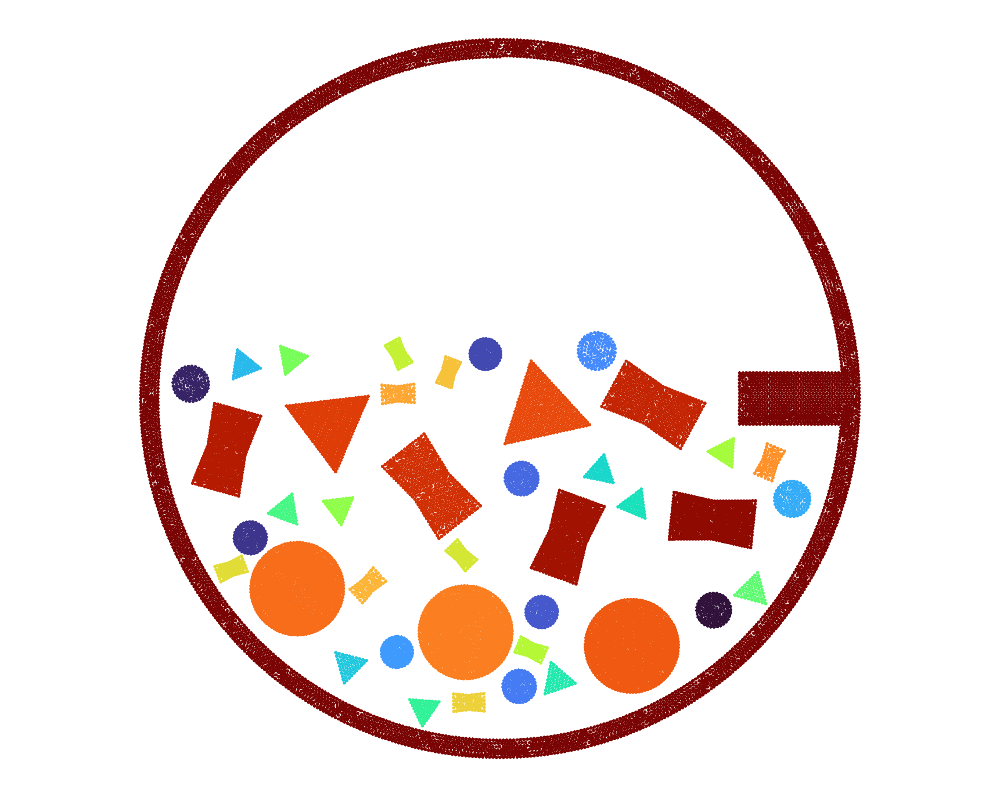

# PeriDEM Examples

Many of the test files are copied from `PeriDEM/test/test_data/peridem`. 

## single_particle

### single_particle_circle
Shows the capability of PeriDEM to handle single particle deformation

### single_particle_rectangle_inbuilt_mesh
Shows the capability of PeriDEM to handle single particle deformation

## two_particles
### twop_circ
Generic test where top circle either free falls or falls with specified initial velocity

### twop_concave_and_hex
Same as `twop_circ` but with non-standard particles

### twop_wall_concave_diff_material_diff_size
Same as `twop_circ` but now with multiple material properties and wall

## compressive_test

### compression_small_set
Compression of 15 particles in a container.

### compression_large_set
Compression of 352 particles in a container. Particles are assigned positions randomly, and the cohort consists of circle, hexagon, triangle, and drum-shaped particles. 

## attrition_tests
### attrition_mix_particles_small_set
Set of 12 particles (circle, hexagon, triangle, and drum shaped) in rotating cylinder with portrusion. 

### attrition_mix_particles_large_set
Set of 12 particles (circle, hexagon, triangle, and drum shaped) in rotating cylinder with portrusion. 

### sim* tests
There are different versions of `particles in a rotating container` tests. We play with number of particles, geometry of rotating container, and rotation speed, etc. 

|       | 
|:-------------------------------------------------------------------------------------------:| 
| [particles in rotating cylinder]](./attrition_tests/sim1_multi_particle_circ_tri_drum_with_rotating_cylinder_with_protrusion/) |

|       | 
|:-------------------------------------------------------------------------------------------:| 
| [particles in rotating rectangle]](./attrition_tests/sim4_multi_particle_circ_tri_drum_hex_with_rotating_rectangle_container_with_protrusion_and_opening_within_bigger_rectangle_container/) |