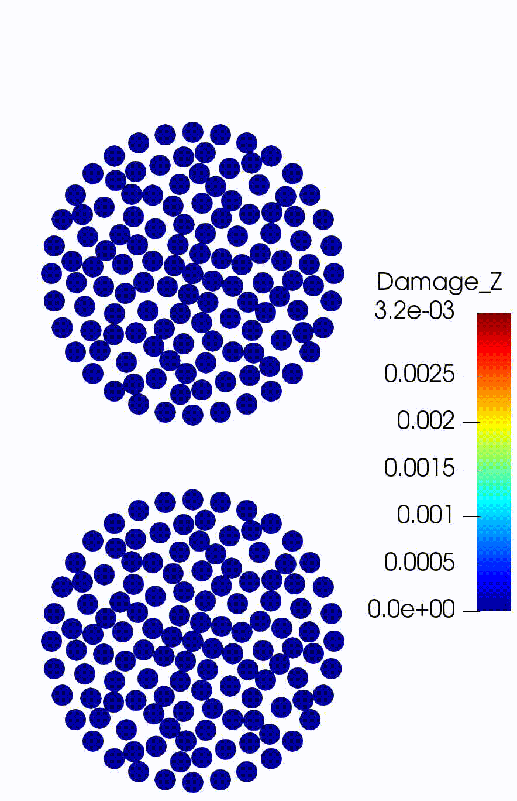
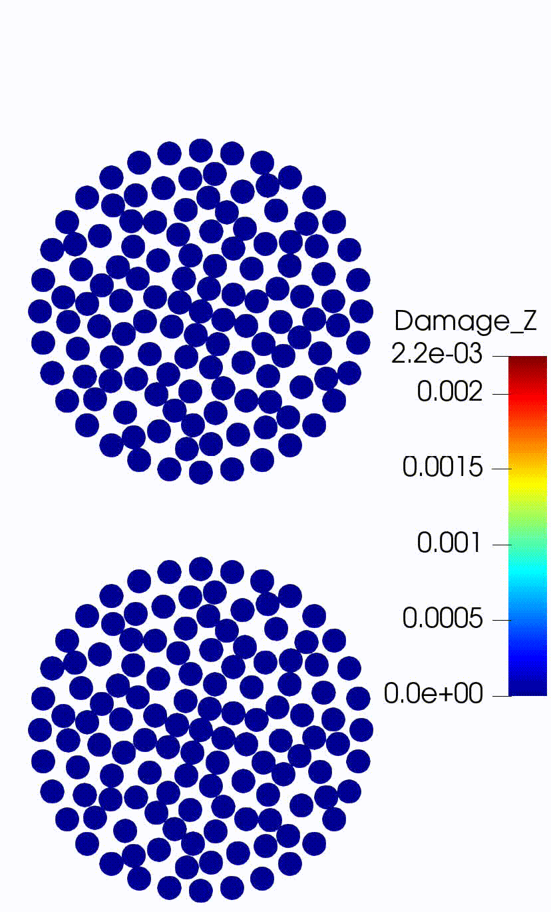

`PeriDEM` folder contains examples for multi-particle simulation and `Peridynamics` provides examples for single particle deformation.

# PeriDEM: Examples

We next highlight some key examples. For more details, look at the `create_input_file()` 
within `problem_setup.py` or `input_0.yaml` in example folders.

To create input files, the python script is included. Python script allows easy parameterization 
of various modeling and geometrical parameters and creating `.geo` files for `gmsh` 
and particle locations file. Typically, the input files consists of:
  - `input.yaml` - the main instruction file for `PeriDEM` with details about material models, 
     particle geometries, time step, etc
  - `particle_locations.csv` - this file provides location and other details of the 
     individual particles. Each row in the file consists of 
    * `i` - zone id that particle belongs to
    * `x` - x-coordinate of the center of the particle. Next two columns are similarly for `y` and `z` coordinates
    * `r` - radius of the particle 
    * `o` - orientation in radians. This is used to give particle (particle mesh) a rotation
  - `mesh.msh` - mesh file for the reference particle or wall. For example, 
    in [compressive test](./PeriDEM/compressive_test/compression_small_set
    /inp) example, running `python3 -B 
    problem_setup.py` will generate following `.msh` files: 
    `mesh_cir_large_0.msh`, `mesh_cir_small_0.msh`, `mesh_drum2d_large_0.
    msh`, `mesh_drum2d_small_0.msh`, `mesh_fixed_container_0.msh`, 
    `mesh_hex_large_0.msh`, `mesh_hex_small_0.msh`, `mesh_moving_container_0.
    msh`, `mesh_tri_large_0.msh`, `mesh_tri_small_0.msh`.

### Two-particle tests

The examples below are for demonstration. Similar results can be obtained by 
modifying and running examples in `PeriDEM/examples/PeriDEM/two_particles/`.

|    |  |
|:-----------------------------------------------------------------:|:------------------------------------------------------------:|
| Circular without damping | Circular with damping  |

|  |   |               |
|:---------------------------------------------------------------------:|:-------------------------------------------------------------------------:|:----------------------------------------------------------------------------------------------:|
|   Different materials   |     Different radius     | Different radius different material |

### Two-particle with wall test

|     | 
|:------------------------------------------------------------------------------------------:| 
|     Concave particles     |

### Compressive tests
Setup for this test consists of 502 circular and hexagonal-shaped particles of varying 
radius and orientation inside a rectangle container. The container's top wall is moving 
downward at a prescribed speed, resulting in the compression of the particle system. 
The quantity of interest is the compressive strength of the media. The reaction force 
(downward) on the moving wall should increase with the increasing penetration of this wall; 
however, after a certain amount of compression of the media, the damage will initiate 
in individual particles, especially those connected by force chains, resulting in the 
yielding of the system. For more details, we refer to 
[Jha et al. 2021](https://prashjha.github.io/publication/jha-2020-peridem/)

|         | 
|:--------------------------------------------------------------------------:| 
|     Compressive test setup     |

|                                                                                                                                                         | 
|:---------------------------------------------------------------------------------------------------------------------------------------------------------------------------------------------------------------------------------:| 
| **Top**: Plot of reaction force per unit area on the top wall. **Bottom**: Particle state at four times. Color shows the damage at nodes. Damage 1 or above indicates the presence of broken bonds in the neighborhood of a node. |

|  | 
|:------------------------------------------------------:| 
|              Compressive test simulation               | 

Examples similar to above can be found in `PeriDEM/examples/PeriDEM/compressive_test/`.

### Attrition tests - Particles in a rotating container
We consider mix of different particles in a rotating container. Particles considered include circular, triangular, hexagonal, and drum shaped. Particles come in large and small shapes (their sizes are purturbed randomly). In order to to introduce diversity of material properties, we considered large particles to be tougher compared to the smaller ones. Setup files are in [PeriDEM/attrition_tests](./PeriDEM/attrition_tests)

|                                                                        |                                                                                                                                                   | 
|:-------------------------------------------------------------------------------------------------------------------------------:|:----------------------------------------------------------------------------------------------------------------------------------------------------------------------------------------------------------:| 
| Rotating cylinder ([setup](./PeriDEM/attrition_tests/sim1_multi_particle_circ_tri_drum_with_rotating_cylinder_with_protrusion)) | Rotating cylinder with center of rotation offset ([setup](./PeriDEM/attrition_tests/sim2_multi_particle_circ_tri_drum_hex_with_rotating_cylinder_with_protrusion_thin_container_and_change_rotation_rate)) | 

Complex container geometries can be considered as well. For example, the image below is from [attrition_tests](./PeriDEM/attrition_tests/sim4_multi_particle_circ_tri_drum_hex_with_rotating_rectangle_container_with_protrusion_and_opening_within_bigger_rectangle_container) and includes rotating rectangle with opening and internal groves of different shapes. The rotating container with particles inside is contained within another rectangle which is fixed in its place.


## Running simulations
Assuming that the input file is `input.yaml` and all other files such as `.msh`
file for particle/wall and particle locations file are created and their filenames
with paths are correctly provided in `input.yaml`, we will run the problem (using 4 threads)
```sh
<path of PeriDEM>/bin/PeriDEM -i input.yaml -nThreads 4
```

Some examples are listed below.

### Two-particle with wall
Navigate to the example directory [PeriDEM/two_particles/twop_wall_concave_diff_material_diff_size/inp](./PeriDEM/two_particles/twop_wall_concave_diff_material_diff_size/inp)
and run the example as follows
```sh
# manually
cd PeriDEM/two_particles/twop_wall_concave_diff_material_diff_size/inp
mkdir ../out # <-- make directory for simulation output. In .yaml, we specify output path as './out'
<peridem build path>bin/PeriDEM -i input_0.yaml -nThreads 2

# or call run.sh script
cd PeriDEM/two_particles/twop_wall_concave_diff_material_diff_size
./run.sh 4 # with 4 threads
```

You may also use the included [problem_setup.py](./PeriDEM/two_particles/twop_wall_concave_diff_material_diff_size/inp/problem_setup.py)
to modify simulation parameters and run the simulation using
[run.sh](./PeriDEM/two_particles/twop_wall_concave_diff_material_diff_size/run.sh).

> :exclamation: You may need to modify the path of `PeriDEM` executable in `run.sh` file.

> In all `problem_setup.py` files in the example and test directory, the main function is `create_input_file()`.
> Here we set all model parameters, create `.yaml` input file, and `.geo` files for meshing.

#### Important remark on modifying input.yaml file
To test the examples quickly, you can directly modify the `input.yaml` and re-run
the simulation as shown above. For example, you can alter `Final_Time`,
`Time_Steps`, `Contact_Radius_Factor`, `Kn`, and other fields in the yaml file.

However, some care is required when changing the geometrical details of particles
and walls in the `input.yaml` file. If you change these details in the `.yaml` file,
you will have to ensure that the `.msh` file correspond to the new geometry.

Except geometrical parameters of walls and particles, rest of the parameters in
`input.yaml` can be modified.

> In due time, we will provide more information on setting up input files and covering
> all aspects of the simulation.

### Compressive test
Navigate to the example directory [PeriDEM/compressive_test/compression_large_set/inp](./PeriDEM/compressive_test/compression_large_set/inp)
and run the example as follows (note that this is a computationally expensive example)
```sh
cd PeriDEM/compressive_test/compression_large_set/inp
mkdir ../out 
<peridem build path>bin/PeriDEM -i input_0.yaml -nThreads 12

# or you can use the run.sh script in the path PeriDEM/compressive_test/compression_large_set/
```

As before:
- you can modify [problem_setup.py](./PeriDEM/compressive_test/compression_large_set/inp/problem_setup.py), see `create_input_file()` method, to change the simulation settings
- run the simulation using [run.sh](./PeriDEM/compressive_test/compression_large_set//run.sh).

### Compute times for various examples (From old version of the code!)
For reference, we list the compute times for various examples.
- `T` is the total compute time in units of `second`
- `T(n)` means compute time when running the example with `n` threads.

| Test | T(1) | T(2) | T(4) | T(8) |
| :--- | :---: |  :---: |  :---: |  :---: |
| two_particles/circ_damp | 143.7 | 95.1 | 76.4 | 78.6 |
| two_particles/circ_damp_diff_radius | 164 | 114.6 | 96.7 | 99.4 |
| two_particles/circ_diff_material | 287.7 | 190.1 | 152.7 | 160 |
| two_particles/circ_diff_radius_diff_material | 329.1 | 229.4 | 195.3 | 200 |
| two_particles/circ_no_damp | 143.8 | 94.5 | 76.7 | 78.5 |
| two_particles_wall/concave_diff_material_diff_size | 2749.9 | 1534.6 | 980.8 | 691.1 |

## Visualizing results
Simulation files `output_*.vtu` can be loaded in either [ParaView](https://www.paraview.org/)
or [VisIt](https://wci.llnl.gov/simulation/computer-codes/visit).

By default, in all tests and examples, we only output the particle mesh, i.e.,
pair of nodal coordinate and nodal volume, and not the finite element mesh
(it can be enabled by setting `Perform_FE_Out: true` within `Output` block in the input `yaml` file).
After loading the file in ParaView, the first thing to do is to change the plot
type from **`Surface`** to **`Point Gaussian`**. Next, a couple of things to do are:
- Adjust the radius of circle/sphere at the nodes by going to the `Properties`
  tab on the left side and change the value of **`Gaussian Radius`**
- You may also want to choose the field to display. For starter, you could
  select the `Damage_Z` variable, a ratio of **maximum bond strain in the neighborhood of a node and critical bond strain**.
  When the `Damage_Z` value is below one at a given node, the deformation in
  the vicinity of that node is elastic, whereas when the value is above 1,
  it indicates there is at least one node in the neighborhood which has bond
  strain above critical strain (meaning the bond between these two nodes is broken)
- You may also need to rescale the plot by clicking on the **`Zoom to Data`** button in ParaView
- Lastly, when the `Damage_Z` is very high at few nodes, you may want to rescale
  the data to the range, say `[0,2]` or `[0,10]`, so that it is easier to identify
  regions with elastic deformation and region with fracture.


# Single particle deformation

In [Peridynamics/circle](./Peridynamics/circle/), circular-shaped particle is deformed by clamping one part of the circle and specifying displacement in the other part. To run the example, you can either run using `PeriDEM` executible or the `Peridynamics` app which only handle single particle deformation:
```sh
# assuming you are in Peridynamics/circle directory
mkdir -p out
# use PeriDEM
<path to PeriDEM>/PeriDEM -i input_0.yaml -nThreads 4
# or use Peridynamics in apps
<path to Peridynamics app>/Peridynamics -i input_0.yaml -nThreads 4
```

The example in [Peridynamics/rectangle](./Peridynamics/rectangle/) is similar to the above example. It uses the in-built mesh for rectangle. 

|    |  |
|:-----------------------------------------------------------------:|:------------------------------------------------------------:|
| [Circle deformation](./Peridynamics/circle/)  | [Rectangle deformation](./Peridynamics/rectangle/) |