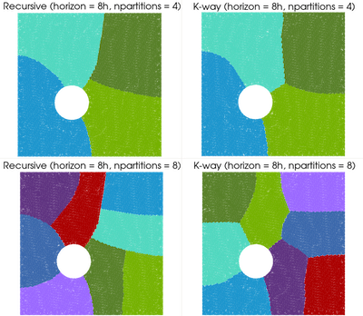

# meshpartitioning 

Test partitioning of mesh for nonlocal interaction. 

Domain and the corresponding mesh:

| Domain | Mesh |
| :--- | :---: |
|  |  |

For the nonlocal length scale `horizon = 4h`, `h` being the mesh size, Metis partitioning using two available methods (recursive and k-way) with number of partitions 4 and 8 are as follows:

For the nonlocal length scale `horizon = 8h`, `h` being the mesh size, Metis partitioning using two available methods (recursive and k-way) with number of partitions 4 and 8 are as follows:

